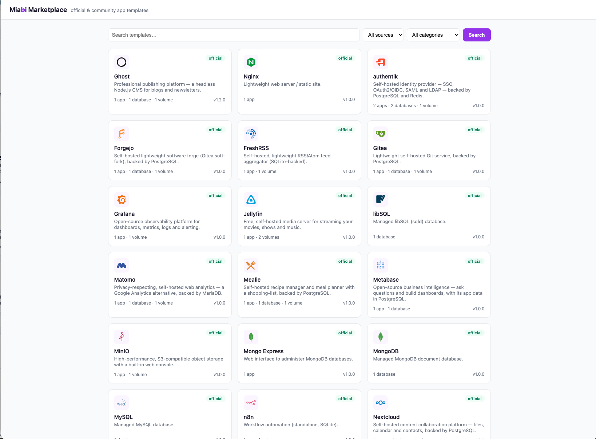
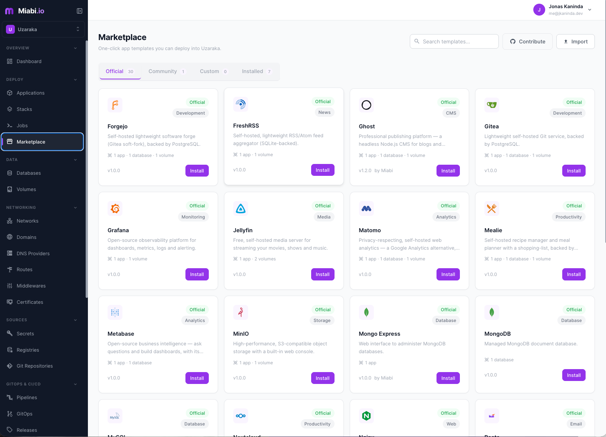

# Miabi Marketplace

The standalone registry + storefront that serves **official and community**
[Miabi](https://github.com/miabi-io/miabi) application & database templates. It
is the *producer* side of the marketplace; Miabi is the *consumer* (it syncs the
catalog into a local cache and serves it in the console).

- **Stateless**: git is the database. Templates under `official/` + `community/`
  are embedded at build time; merging to `main` regenerates the catalog so it
  always matches the repo.
- **Two ways to consume it** — Miabi works with either:
  - **Static (no server, recommended):** CI commits `export.json` (the full
    bundle) on merge; Miabi syncs it straight from the CDN. Point
    `MIABI_MARKETPLACE_URL` at
    `https://cdn.jsdelivr.net/gh/miabi-io/marketplace@main/export.json` (jsDelivr,
    ETag/304-capable). Nothing to host.
  - **Server (optional, self-host):** run the Okapi service below for the live
    API + storefront at e.g. `marketplace.miabi.io`; point
    `MIABI_MARKETPLACE_URL` at its base URL.

## Repository layout

```
official/<name>/<version>/template.yaml   curated, CODEOWNERS-protected (source of truth for official)
official/<name>/metadata.yaml             optional storefront metadata (featured, screenshots, …)
official/<name>/README.md                 optional long description (detail page)
community/<name>/...                      contributed, same shape; open PRs
export.json                               GENERATED full bundle (every manifest inline) — served via jsDelivr
registry/index.json                       GENERATED lightweight machine index (CI checks for drift)
manifest/                                 the miabi.io/v1 manifest module: parse + validate + digest
schema/template.schema.json               JSON Schema for editors + CI
internal/{catalog,api,storefront}         the Okapi service
cmd/marketplace                           server + generate-index + lint
```

`<name>` is the template **handle** — lowercase `^[a-z0-9][a-z0-9-]*$`, matching
the manifest's `metadata.name` and unique across `official/` + `community/`. The
manifest also carries a `metadata.displayName` (the free-text label shown in the
storefront and console) and a `metadata.version`.

## API

The service mirrors the Miabi/Posta stack (Go + Okapi, `{success,data,error}`
envelope on client routes). Machine routes (`/v1/export`, `/v1/index`) return
their raw document so a consumer can decode it directly; `/v1/export` is Miabi's
primary sync call.

The full reference — every route, parameters, and schemas — is served live and
interactive:

| Path | Purpose |
|------|---------|
| `/docs` | **Interactive API documentation** (browse and try every endpoint). |
| `/openapi.json` | The raw OpenAPI spec behind `/docs`. |
| `/healthz` · `/metrics` | Health probe + Prometheus metrics. |

## Storefront

Server-rendered (no build step): a paginated, searchable home grid and a
per-template detail page, served from the same catalog at `/` and
`/templates/{name}`.

<p align="center">
  
</p>

## Run

```sh
go run ./cmd/marketplace            # serve on :8088 (MARKETPLACE_PORT to override)
go run ./cmd/marketplace lint       # validate every embedded template
go run ./cmd/marketplace generate   # rewrite export.json + registry/index.json (CI runs + diffs this)
```

## How Miabi consumes it

Miabi does a conditional GET (ETag) of the bundle — either the static
`export.json` on the CDN or this service's `/v1/export` — caches it in Redis, and
merges it with its embedded official floor and per-workspace custom imports,
serving Official / Community / Custom tabs locally (search + pagination are done
client-side, so no server round-trips are needed). Set `MIABI_MARKETPLACE_URL` to
the CDN `export.json` URL or a server base URL to enable the sync (empty =
embedded-only / air-gapped).

<p align="center">
  
</p>

## Contributing

See [CONTRIBUTING.md](CONTRIBUTING.md). Community templates are a fast
PR-to-live path; official templates are maintainer-gated via `CODEOWNERS`. You
can also test a template live before contributing by importing it into the Miabi
console (**Marketplace → Import**) and installing it.